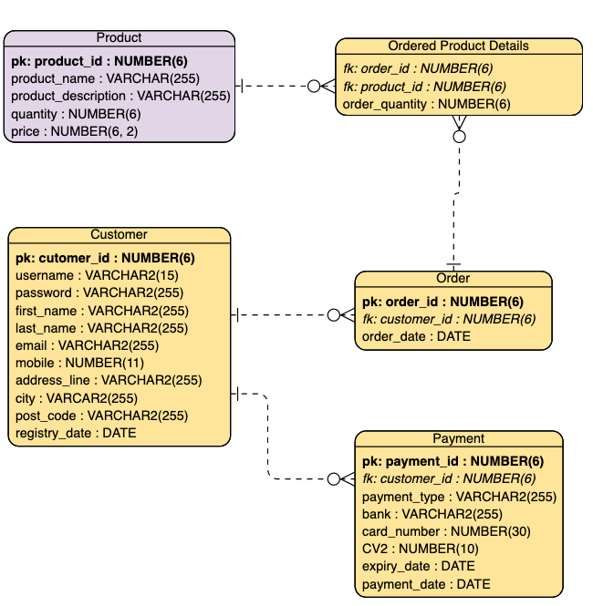

# spring-boot-tutorials

| Example Projects | 
| ----------- | 
| [Spring Boot MongoDB REST API (Simple)](https://github.com/arsy786/spring-boot-mongodb-rest-api)| 
| [Football Club Management System (Advanced)](https://github.com/arsy786/football-club-management-system) | 

<ins>Background

Spring Boot is basically an extension of the Spring framework, which eliminates the boilerplate configurations required for setting up a Spring application.
Spring Boot provides a number of opinionated default configurations and starter dependencies for different Spring modules. Some of the most commonly used ones are:
- spring-boot-starter-data-jpa 
- spring-boot-starter-security 
- spring-boot-starter-test 
- spring-boot-starter-web 

Spring requires the dispatcher servlet, mappings, and other supporting configurations to be defined. We can do this using either the web.xml file or an Initializer class. 
But, Spring Boot only needs a couple of properties to make things work once we add the **web starter**.

All the Spring configuration is automatically included by adding the Boot web starter through a process called auto-configuration.

“If you are going to use Spring I can't think of any reasons to do it without Spring Boot.” - Somebody

<ins>Supporting Material

[Comparison Between Spring and Spring Boot (Baeldung)](https://www.baeldung.com/spring-vs-spring-boot)
 
[Spring Boot Tutorial | Full Course (YouTube/AmigosCode)](https://www.youtube.com/watch?v=9SGDpanrc8U)
 

## Table of Contents
[1. Database Design](#1-database-design)
 
&nbsp;&nbsp;&nbsp;&nbsp;&nbsp;[1.1 Requirements Analysis](#11-requirements-analysis)
 
&nbsp;&nbsp;&nbsp;&nbsp;&nbsp;[1.2 Organising Data](#12-organising-data)
 
&nbsp;&nbsp;&nbsp;&nbsp;&nbsp;[1.3 Primary Keys and Relationships](#13-primary-keys-and-relationships)
 
&nbsp;&nbsp;&nbsp;&nbsp;&nbsp;[1.4 Normalising](#14-normalising)
 
[2. Database Selection](#2-database-selection)
 
[3. SQL/NoSQL](#3-sqlnosql)
 
&nbsp;&nbsp;&nbsp;&nbsp;&nbsp;[3.1 Queries](#31-queries)
 
&nbsp;&nbsp;&nbsp;&nbsp;&nbsp;[3.2 Joins](#32-joins)
 
&nbsp;&nbsp;&nbsp;&nbsp;&nbsp;[3.3 Indexes](#33-indexes)
 
&nbsp;&nbsp;&nbsp;&nbsp;&nbsp;[3.4 Transactions](#34-transactions)
 
&nbsp;&nbsp;&nbsp;&nbsp;&nbsp;[3.5 Locking](#35-locking)
 
[4. Java Database Connectivity](#4-java-database-connectivity)
 
&nbsp;&nbsp;&nbsp;&nbsp;&nbsp;[4.1 JDBC](#41-jdbc)
 
&nbsp;&nbsp;&nbsp;&nbsp;&nbsp;[4.2 JPA](#42-jpa)
 
&nbsp;&nbsp;&nbsp;&nbsp;&nbsp;[4.3 Hibernate](#43-hibernate)
 
&nbsp;&nbsp;&nbsp;&nbsp;&nbsp;[4.4 Entity Relationships](#44-entity-relationships)
 
&nbsp;&nbsp;&nbsp;&nbsp;&nbsp;[4.5 Entity Lifecycle](#45-entity-lifecycle)
 
&nbsp;&nbsp;&nbsp;&nbsp;&nbsp;[4.6 Transactions](#46-transactions)
 
[5. Spring Data](#5-spring-data)
 
&nbsp;&nbsp;&nbsp;&nbsp;&nbsp;[5.1 Spring Data JDBC (JdbcTemplate)](#51-spring-data-jdbc-jdbctemplate)
 
&nbsp;&nbsp;&nbsp;&nbsp;&nbsp;[5.2 Spring Data JPA](#52-spring-data-jpa)
 
&nbsp;&nbsp;&nbsp;&nbsp;&nbsp;[5.3 Spring Data MongoDB](#53-spring-data-mongodb)
 
&nbsp;&nbsp;&nbsp;&nbsp;&nbsp;[5.4 Spring Data Extra](#54-spring-data-extra)
 
[6. Testing](#6-testing)
 
[7. Microservices](#7-microservices)
 

## 1. Database Design

A well-structured db:
1. Saves disk space by eliminating redundant data
2. Maintains data accuracy and integrity
3. Provides access to the data in useful ways

Designing an efficient, useful database is a matter of following the proper process, including the phases covered in this Section.

<ins>Supporting Material

[How to Design Your First Database (YouTube/CBTNuggets)](https://www.youtube.com/watch?v=cepspxPAUTA)
 
[The Database Design Process (Lucidchart)](https://www.lucidchart.com/pages/database-diagram/database-design)
 

### 1.1 Requirements Analysis

Understanding the purpose of your db will inform your choices throughout the design process.
Some ways to gather information before creating the db include: interviewing the people who will use it, analysing business forms (invoices, timesheets, surveys) and combing through any existing data systems (including physical and digital files).

Once existing data has been gathered, list the types of data you want to store and entities, people, things, locations, events etc.
For example:

- Customers: Name, Address, City, State, Zip, Email address
- Products: Name, Price, Quantity in stock, Quantity on order
- Orders: Order ID, Sales representative, Date, Product(s), Quantity, Price, Total

Be sure to break the information down to the smallest useful pieces, for example consider separating the street address from the country,
so you can later filter individuals by their country of residence.

NOTE: Avoid placing the same data point in more than one table, this adds unnecessary complexity.

### 1.2 Organising Data

Layout a visual representation of the db via an Entity Relationship Diagram (ERD).
The ERD displays the table as a box with the title indicating the entity (Student) with the attributes listed below (StudentID, Birth Date, Grade Level etc.)

To convert lists of data into tables, start by creating a table for each type of entity, such as products, sales, customers, orders.
To keep data consistent for all records, assign the appropriate data type to each column (e.g. VARCHAR, INT, etc.)

Each row of a table is called a "Record". Each column is called a "Field" or "Attribute".

### 1.3 Primary Keys and Relationships

<ins>Primary Keys

You must decide which attribute will serve as the PK for a given Table.
The PK is a unique identifier for a given entity.
Attributes that are chosen as PK’s should be unique, unchanging, and always present (never NULL or empty).
It must be noted that you can use multiple fields in conjunction to form a PK (known as a composite key).

<ins>Relationships

Each entity can have a relationship with every other one, but those relationships are typically one of three types: 
One-to-One, One-to-Many, Many-to-Many.

To implement a One-to-Many relationship in a db, simply add the PK from the “One” side of the relationship as an attribute 
in the "Many" table (this becomes a fk). The Table on the "One" side is considered a "Parent" table to the "Child" table on the other ("Many") side.

To implement Many-to-Many relationship in a db, you must break it up into 2 One-to-Many relationships. 
This is done by creating a new entity between the two tables.

Another way to analyse relationship is to consider which side of the relationship must exist for the other table to exist. 
The non-mandatory side can be marked (as shown above) with a circle on the line where a dash would be. 
For example, as shown above, products must exist for orders to be made.

<ins>Recursive and Redundant Relationships

- Recursive relationship: sometimes a table points back to itself. e.g. employee table might have a manager field that refers to another employee in same table.
- Redundant relationship: is one that is expressed more than once. It is best to delete the least useful link between the entities.

### 1.4 Normalising

Once you have a design for your db, you can apply the normalisation rules to ensure tables are structured correctly.

Normalisation Rules:
- First normal form (1NF): Each cell in the table can only have one value, never a list of values.
- Second normal form (2NF): Each of the attributes should be fully dependent on the entire PK.
- Third normal form (3NF): Every non-key column must be independent of every other column.

NOTE: There are more NF’s but the first three are the most common.
 
NOTE: CRUD db’s should be normalised.
 

## 2. Database Selection

A database is an organised collection of structured information, or data, typically stored electronically in a computer system.
A database is usually controlled by a database management system (DBMS).

MongoDB is one of the most popular NoSQL databases. It’s a general-purpose database that’s document-based.
As a document database, MongoDB stores data in JSON-like documents and its syntax is similar to JavaScript.

Differences between SQL and NoSQL databases are as follows:

|                               | SQL           | NoSQL         |
| ------------------------------| --------------| --------------|
| Data Storage Model            | stores data in tables with fixed rows and columns      | stores data like documents, key-value pairs, wide-columns and graphs       |
| Data Storage Type             | structured data only   | structured and unstructured data        |
| Objective                     | general-purpose databases      | general-purpose and can be used for storing documents, key-value pairs, wide-column data, etc.       |
| Schema                        | uses a rigid schema   | is flexible        |
| Scaling                       | scale up with larger servers (vertical scaling)      | scale up with more servers (horizontal scaling) |
| “Joins”                       | supports “Joins”   | does not support them        |
| Multi-record ACID compliance  | supports multi-record ACID properties  | often does not support them        |

NOTE: Wide-column data refers to tables with rows and dynamic columns.
 
NOTE: ACID stands for Atomicity, Consistency, Isolation, and Durability.

<ins>Supporting Material

<ins>SQL

[SQL Cheat Sheet (PDF/LearnSQL)](https://github.com/arsy786/prerequisites-and-extra-tutorials/blob/main/sql-basics-cheat-sheet-ledger.pdf)
 
[PostgreSQL CRASH COURSE (YouTube/TroyAmelotte)](https://www.youtube.com/watch?v=zw4s3Ey8ayo)
 

<ins>MongoDB (NoSQL):

[MongoDB Cheat Sheet (PDF/WebDevSimplified)](https://github.com/arsy786/prerequisites-and-extra-tutorials/blob/main/MongoDB-Dark.pdf)
 
[MongoDB Cheat Sheet (GitHub/bradtraversy)](https://gist.github.com/bradtraversy/f407d642bdc3b31681bc7e56d95485b6)
 
[How do NoSQL databases work? (YouTube/SimplyExplained)](https://www.youtube.com/watch?v=0buKQHokLK8)
 
[MongoDB Crash Course (Youtube/WebDevSimplified)](https://www.youtube.com/watch?v=ofme2o29ngU)
 

## 3. SQL/NoSQL

### 3.1 Queries
A query can either be a request for data results from your database or for action on the data, or for both.
A query can give you an answer to a simple question, perform calculations, combine data from different tables, add,
change, or delete data from a database.

### 3.2 Joins

A join is an SQL operation performed to establish a connection between two or more database tables based on matching columns,
thereby creating a relationship between the tables. Most complex queries in an SQL database management system involve join commands.

Types of Joins:

- (INNER) JOIN: Returns records that have matching values in both tables.
- LEFT (OUTER) JOIN: Returns all records from the left table, and the matched records from the right table.
- RIGHT (OUTER) JOIN: Returns all records from the right table, and the matched records from the left table.
- FULL (OUTER) JOIN: Returns all records when there is a match in either left or right table.

<ins>Supporting Material

[SQL Joins Explained (YouTube/Socratica)](https://www.youtube.com/watch?v=9yeOJ0ZMUYw)
 

### 3.3 Indexes

An index is used to speed up searching in the database. It can be used to efficiently find all rows matching some column in your query and then walk through only that subset of the table to find exact matches. If you don't have indexes on any column in the WHERE clause, the SQL server has to walk through the whole table and check every row to see if it matches, which may be a slow operation on big tables.

<ins>Supporting Material

Link to: [SQL Index (YouTube/Socratica)](https://www.youtube.com/watch?v=fsG1XaZEa78)
 

### 3.4 Transactions

A transaction is a logical unit of work that contains one or more SQL statements. A transaction is an atomic unit. The effects of all the SQL statements in a transaction can be either all committed (applied to the database) or all rolled back (undone from the database).

<ins>Supporting Material

[What is a Database transaction? (YouTube/HusseinNasser)](https://www.youtube.com/watch?v=P80Js_qClUE)
 

### 3.5 Locking

Locks are held on SQL Server resources, such as rows read or modified during a transaction, to prevent concurrent use of resources by different transactions. For example, if an exclusive (X) lock is held on a row within a table by a transaction, no other transaction can modify that row until the lock is released.

<ins>Supporting Material

[SQL Server Working with Locks (YouTube/EagleMedia)](https://www.youtube.com/watch?v=uBr_uAyeJVo)
 

## 4. Java Database Connectivity

You have a java program on one side and the relational database on the other side. 
Let's check what happens when you connect these and get an overview of the tools which can help you to do this.

<ins>Supporting Material

[JDBC vs JPA vs Hibernate vs Spring Data JPA in 9 minutes (YouTube/JavaMaster)](https://www.youtube.com/watch?v=GX3D0OIFOhE)
 

### 4.1 JDBC

JDBC is an API for Java applications that defines how a client may access a database. An application uses this API to communicate with a JDBC manager. 

### 4.2 JPA

The Java Persistence API (JPA) provides a specification for persisting, reading, and managing data from your Java object to relational tables in the database.
It allows us to map our domain model directly to the database structure and then gives us the flexibility of manipulating objects in our code.

Before JPA, we used JDBC API to query these relational databases. 
With JDBC, we have to provide native SQL queries as well as handling cumbersome JDBC components like Connection, ResultSet, etc. Writing those String representations of SQL was not 
only tedious but also error-prone. Moreover,the query syntax may change when you change your database.

### 4.3 Hibernate

Hibernate is an object-relational mapping solution for Java environments. Object-relational mapping or ORM is the programming technique to map application domain model objects to the relational database tables.

JPA is the interface while Hibernate is the implementation ("JPA is the dance, Hibernate is the dancer").

Hibernate and JPA are actually built on top of the JDBC API. Hibernate and JPA act as an abstraction layer and subsequently hide the low-level JDBC calls from the developer, which makes database programming much easier.

### 4.4 Entity Relationships

Through JPA annotations when we are using Hibernate, we are able to manage relationships between two tables as if they were objects. This makes it easier to map database attributes with the application object model. Depending on the business logic and how we model, we can create unidirectional or bidirectional relationships.

The types of relationships are:
- OneToOne
- OneToMany
- ManyToOne
- ManyToMany

NOTE: ManyToMany = OneToMany + ManyToOne (Join Table)

Below is a guide explaining each of these relationships and their implementations.

<ins>Supporting Material

[Hibernate - OneToOne, OneToMany, ManyToOne and ManyToMany (dev.to/JonathanFaber)](https://dev.to/jhonifaber/hibernate-onetoone-onetomany-manytoone-and-manytomany-8ba)
 
[For ManyToOne, the ‘Many’ references the ‘One’. Why is this the case? (YouTube/TroyAmelotte)](https://www.youtube.com/watch?v=zw4s3Ey8ayo&t=2220s)
 

### 4.5 Entity Lifecycle

<ins>Supporting Material

[JPA & Hibernate: Entity Lifecycle Model (Youtube/ThorbenJanssen)](https://www.youtube.com/watch?v=Y7PpjerZkc0)
 

### 4.6 Transactions

<ins>Supporting Material

[Spring & Spring Data JPA: Managing Transactions (YouTube/ThorbenJanssen)](https://www.youtube.com/watch?v=SUQxXg229Xg)
 

## 5. Spring Data

Spring Data is a part of the Spring Framework. The goal of Spring Data repository abstraction is to significantly reduce the amount of boilerplate code required to implement data access layers for various persistence stores.

We can configure Spring Boot with any DB via application.properties configurations.

### 5.1 Spring Data JDBC (JDBCTemplate)

Spring JdbcTemplate is a powerful mechanism to connect to the database and execute SQL queries. It internally uses JDBC API, but eliminates a lot of problems of JDBC API.

The problems of JDBC API are:
- too much code before and after executing the query, such as creating connection, statement, closing resultset, connection etc.
- performing exception handling code on the database logic.
- handling transactions.
- repeating and re-writing code from one db to another db's logic is a time-consuming task.

Spring JdbcTemplate eliminates all the above-mentioned problems of JDBC API. It provides you methods to write the queries directly, so it saves a lot of work and time.

### 5.2 Spring Data JPA

The Spring Data JPA is one of the many Spring Data projects, and it aims towards bringing consistency in accessing data for relational 
datastores. Many people believe Spring Data JPA is a JPA implementation. In reality, this is not the case. 
Spring Data JPA uses a default JPA Implementation called Hibernate. The default JPA implementation is configurable, and if we wish, 
we can use other implementations as well.

Spring Data JPA brings in the concept of JPA Repositories, a set of Interfaces that defines query methods. 
The @Repository and @Entity Bean represent the DAO layer in the application. No need to write native queries anymore. 
Nonetheless, we do have the option of writing queries or part of queries (when necessary), but those are JQL queries and not native database queries.

<ins>Supporting Material

[Spring Data JPA Tutorial (YouTube/DailyCodeBuffer)](https://www.youtube.com/watch?v=XszpXoII9Sg)
 

### 5.3 Spring Data MongoDB

<ins>Supporting Material

[Spring Boot MongoDB REST API (GitHub/ArsalaanNaeem)](https://github.com/arsy786/spring-boot-mongodb-rest-api#24-creating-rest-api-service--controller)
 
[Spring Data MongoDB Tutorial (ProgrammingTechie)](https://programmingtechie.com/2021/01/06/spring-data-mongodb-tutorial/)
 

### 5.4 Spring Data Extra

<ins>Supporting Material

[Validate HTTP Request Body with Hibernate Bean Validation Constraints (YouTube/SergeyKargopolov)](https://www.youtube.com/watch?v=t0fBkt_s4fk)
 
[Spring Data JPA: Partially updating existing records (YouTube/CodeWithAGS)](https://www.youtube.com/watch?v=hqAv1SXvTFs)
 

## 6. Testing

Testing is important for ensuring that your application performs as expected when faced with a wide variety of expected and unexpected requests. This process is designed to not only test the API's functionality — but also its reliability, performance, and security.

Testing is a very important topic and has a variety of implementations.
There are a few different approaches to testing available in Spring Boot.
But, you must first be familiar with testing in Java core.

Testing has been covered in the links provided below:

| Testing Sections | Link |
| ----------- |-------| 
| Testing in Java core|[Java Quick Reference - 18. Test Driven Development](https://github.com/arsy786/prerequisites-and-extra-tutorials/blob/main/Java_QuickReference_v1.1.pdf)|
| Testing in Spring Boot |[Football Club Management System - 4.3 Testing](https://github.com/arsy786/football-club-management-system#43-testing)|

<ins>Supporting Material

[What is Postman? (YouTube/ITIndustryExposure)](https://www.youtube.com/watch?v=E0f9DUEN_jI)
 
[Learn JSON in 10 Minutes (YouTube/WebDevSimplified)](https://www.youtube.com/watch?v=iiADhChRriM&t=1s)
 
[Convert Java to JSON & Json to Java Object | ObjectMapper (YouTube/SwatechTalks)](https://www.youtube.com/watch?v=pv1VCFWTP-I&t=736s)
 

## 7. Microservices

Microservices are an architectural and organizational approach to software development where software is composed of small independent services that communicate over well-defined APIs.

Microservices have been covered in detail in the link provided below:

| Sections | Link |
| ----------- |-------| 
| Spring Boot Microservices |[https://github.com/arsy786/spring-boot-microservices-new](https://github.com/arsy786/spring-boot-microservices-new)|