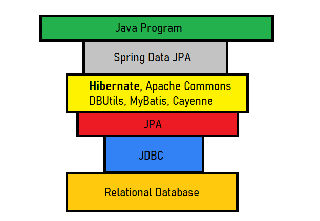

# spring-boot-tutorials

> Spring Boot Sample Project (Basic): [Spring Boot MongoDB REST API](https://github.com/arsy786/spring-boot-mongodb-rest-api#24-creating-rest-api-service--controller)

> Spring Boot Sample Project (Advanced): [Football Club Management System (FCMS)](https://github.com/arsy786/football-club-management-system)

Spring Boot is basically an extension of the Spring framework, which eliminates the boilerplate configurations required for setting up a Spring application.
Spring Boot provides a number of opinionated default configs and starter dependencies for different Spring modules. Some of the most commonly used ones are:
- spring-boot-starter-data-jpa 
- spring-boot-starter-security 
- spring-boot-starter-test 
- spring-boot-starter-web 
- spring-boot-starter-thymeleaf

Spring requires the dispatcher servlet, mappings, and other supporting configurations to be defined. We can do this using either the web.xml file or an Initializer class. 
But, Spring Boot only needs a couple of properties to make things work once we add the **web starter**.

All the Spring configuration is automatically included by adding the Boot web starter through a process called auto-configuration.

“If you are going to use Spring I can't think of any reasons to do it without Spring Boot.”

Link to: [Spring Boot Tutorial | Full Course (YouTube/AmigosCode)](https://www.youtube.com/watch?v=9SGDpanrc8U)
 
Link to: [A Comparison Between Spring and Spring Boot (Baeldung)](https://www.baeldung.com/spring-vs-spring-boot)
 

## Table of Contents
[1. Database Selection](#1-database-selection)
 
[2. Java Database Connectivity ](#2-java-database-connectivity)
 
&nbsp;&nbsp;&nbsp;&nbsp;&nbsp;[2.1 JDBC](#21-jdbc)
 
&nbsp;&nbsp;&nbsp;&nbsp;&nbsp;[2.2 JPA](#22-jpa)
 
&nbsp;&nbsp;&nbsp;&nbsp;&nbsp;[2.3 Hibernate](#23-hibernate)
 
&nbsp;&nbsp;&nbsp;&nbsp;&nbsp;[2.4 Entity Relationships](#24-entity-relationships)
 
&nbsp;&nbsp;&nbsp;&nbsp;&nbsp;[2.5 Entity Lifecycle](#25-entity-lifecycle)
 
&nbsp;&nbsp;&nbsp;&nbsp;&nbsp;[2.6 Transactions](#26-transactions)
 
[3. Spring Data](#3-spring-data)
 
&nbsp;&nbsp;&nbsp;&nbsp;&nbsp;[3.1 Spring Data JDBC (JdbcTemplate)](#31-spring-data-jdbc-jdbctemplate)
 
&nbsp;&nbsp;&nbsp;&nbsp;&nbsp;[3.2 Spring Data JPA](#32-spring-data-jpa)
 
&nbsp;&nbsp;&nbsp;&nbsp;&nbsp;[3.3 Spring Data MongoDB](#33-spring-data-mongodb)
 
&nbsp;&nbsp;&nbsp;&nbsp;&nbsp;[3.4 Spring Data Extra](#34-spring-data-extra)
 
[4. Database Design](#4-database-design)
 
&nbsp;&nbsp;&nbsp;&nbsp;&nbsp;[4.1 Requirements Analysis](#41-requirements-analysis)
 
&nbsp;&nbsp;&nbsp;&nbsp;&nbsp;[4.2 Organising Data](#42-organising-data)
 
&nbsp;&nbsp;&nbsp;&nbsp;&nbsp;[4.3 Primary Keys and Relationships](#43-primary-keys-and-relationships)
 
&nbsp;&nbsp;&nbsp;&nbsp;&nbsp;[4.4 Normalising](#44-normalising)
 
[5. SQL/NoSQL](#5-sqlnosql)
 
&nbsp;&nbsp;&nbsp;&nbsp;&nbsp;[5.1 Queries](#51-queries)
 
&nbsp;&nbsp;&nbsp;&nbsp;&nbsp;[5.2 Joins](#52-joins)
 
&nbsp;&nbsp;&nbsp;&nbsp;&nbsp;[5.3 Indexes](#53-indexes)
 
&nbsp;&nbsp;&nbsp;&nbsp;&nbsp;[5.4 Transactions](#54-transactions)
 
&nbsp;&nbsp;&nbsp;&nbsp;&nbsp;[5.5 Locking](#55-locking)
 
[6. Testing](#6-testing)
 
[7. Microservices](#7-microservices)
 

## 1. Database Selection

A database is an organised collection of structured information, or data, typically stored electronically in a computer system. 
A database is usually controlled by a database management system (DBMS).

MongoDB is one of the most popular NoSQL databases. It’s a general-purpose database that’s document-based. 
As a document database, MongoDB stores data in JSON-like documents and its syntax is similar to JavaScript.

Differences between SQL and NoSQL databases are as follows:

|                               | SQL           | NoSQL         |
| ------------------------------| --------------| --------------|
| Data Storage Model            | stores data in tables with fixed rows and columns      | stores data like documents, key-value pairs, wide-columns and graphs       |
| Data Storage Type             | structured data only   | structured and unstructured data        |
| Objective                     | general-purpose databases      | general-purpose and can be used for storing documents, key-value pairs, wide-column data, etc.       |
| Schema                        | uses a rigid schema   | are flexible        |
| Scaling                       | scale up with larger servers (vertical scaling)      | scale up with more servers (horizontal scaling) |
| “Joins”                       | supports “Joins”   | does not support them        |
| Multi-record ACID compliance  | supports multi-record ACID properties  | often does not support them        |

NOTE: “Wide-column” data refers to tables with rows and dynamic columns.
 
NOTE: ACID = “Atomicity”, “Consistency”, “Isolation”, and “Durability”

SQL:
 
> Link to: [SQL Cheat Sheet (PDF)](https://github.com/arsy786/prerequisites-and-extra-tutorials/blob/main/sql-basics-cheat-sheet-ledger.pdf)
 

Link to: [PostgreSQL CRASH COURSE (YouTube/TroyAmelotte)](https://www.youtube.com/watch?v=zw4s3Ey8ayo)
 

MongoDB (NoSQL):
 
> Link to: [MongoDB Cheat Sheet (PDF)](https://github.com/arsy786/prerequisites-and-extra-tutorials/blob/main/MongoDB-Dark.pdf)
 

Link to: [MongoDB Cheat Sheet (GitHub)](https://gist.github.com/bradtraversy/f407d642bdc3b31681bc7e56d95485b6)
 
Link to: [How do NoSQL databases work? (YouTube/SimplyExplained)](https://www.youtube.com/watch?v=0buKQHokLK8)
 
Link to: [MongoDB Crash Course (Youtube/WebDevSimplified)](https://www.youtube.com/watch?v=ofme2o29ngU)
 

## 2. Java Database Connectivity

You have a java program on one side and the relational database on the other side. Let's check what happens when you connect these and get the overview of the tools which can you help to do this.

Link to: [JDBC vs JPA vs Hibernate vs Spring Data JPA in 9 minutes (YouTube/JavaMaster)](https://www.youtube.com/watch?v=GX3D0OIFOhE)
 

### 2.1 JDBC

JDBC is an API for Java applications that defines how a client may access a database. An application uses this API to communicate with a JDBC manager. 

### 2.2 JPA

The Java Persistence API (JPA) provides a specification for persisting, reading, and managing data from your Java object to relational tables in the database.
It allows us to map our domain model directly to the database structure and then gives us the flexibility of manipulating objects in our code.

Before JPA, we used JDBC API to query these relational databases. 
With JDBC, we have to provide native SQL queries as well as handling cumbersome JDBC components like Connection, ResultSet, etc. Writing those String representations of SQL was not 
only tedious but also error-prone. Moreover, query syntax may change when you change your database.

### 2.3 Hibernate

Hibernate is an object-relational mapping solution for Java environments. Object-relational mapping or ORM is the programming technique to map application domain model objects to the relational database tables.

JPA is the interface while Hibernate is the implementation ("JPA is the dance, Hibernate is the dancer").

Hibernate and JPA are actually built on top of the JDBC API. Hibernate and JPA act as an abstraction layer and subsequently hide the low-level JDBC calls from the developer, which makes database programming much easier.

### 2.4 Entity Relationships

Through JPA annotations when we are using Hibernate, we are able to manage relationships between two tables as if they were objects. This makes it easier to map database attributes with the application object model. Depending on the business logic and how we model, we can create unidirectional or bidirectional relationships.

There are a few types of relationships:
- OneToOne
- OneToMany
- ManyToOne
- ManyToMany

Below is a guide explaining each of these relationships and their implementations.
 
Link to: [Hibernate - OneToOne, OneToMany, ManyToOne and ManyToMany (dev.to/JonathanFaber)](https://dev.to/jhonifaber/hibernate-onetoone-onetomany-manytoone-and-manytomany-8ba)
 

NOTE: For ManyToOne, the ‘Many’ references the ‘One’. Why is this the case? -> [(YouTube/TroyAmelotte)](https://www.youtube.com/watch?v=zw4s3Ey8ayo&t=2220s)
 
NOTE: ManyToMany = OneToMany + ManyToOne (Join Table)

### 2.5 Entity Lifecycle
Link to: [JPA & Hibernate: Entity Lifecycle Model (Youtube/ThorbenJanssen)](https://www.youtube.com/watch?v=Y7PpjerZkc0)
 

### 2.6 Transactions
Link to: [Spring & Spring Data JPA: Managing Transactions (YouTube/ThorbenJanssen)](https://www.youtube.com/watch?v=SUQxXg229Xg)
 

## 3. Spring Data

Spring Data is a part of the Spring Framework. The goal of Spring Data repository abstraction is to significantly reduce the amount of boilerplate code required to implement data access layers for various persistence stores.

We can configure Spring Boot with any DB via application.properties configurations.

### 3.1 Spring Data JDBC (JDBCTemplate)

Spring JdbcTemplate is a powerful mechanism to connect to the database and execute SQL queries. It internally uses JDBC API, but eliminates a lot of problems of JDBC API.

The problems of JDBC API are:
- lots of code before and after executing the query, such as creating connection, statement, closing resultset, connection etc.
- perform exception handling code on the database logic.
- handle transaction.
- Repetition of all these codes from one db to another db's logic is a time-consuming task.

Spring JdbcTemplate eliminates all the above-mentioned problems of JDBC API. It provides you methods to write the queries directly, so it saves a lot of work and time.

### 3.2 Spring Data JPA

The Spring Data JPA is one of the many Spring Data projects, and it aims towards bringing consistency in accessing data for relational datastores. Many people consider Spring Data JPA is a JPA implementation. In reality, it is false. Spring Data JPA uses a default JPA Implementation called Hibernate. The default JPA implementation is configurable, and if we wish, we can use other implementations as well.

Spring Data JPA brings in the concept of JPA Repositories, a set of Interfaces that defines query methods. The Repository and Entity Bean represent the DAO layer in the application. No need to write native queries anymore. Sometimes we need to write queries or part of queries, but those are JQL queries and not native database queries.

Link to: [Spring Data JPA Tutorial (YouTube/DailyCodeBuffer)](https://www.youtube.com/watch?v=XszpXoII9Sg)
 

### 3.3 Spring Data MongoDB

> Spring Data MongoDB Sample Project:
> **[Spring Boot MongoDB REST API](https://github.com/arsy786/spring-boot-mongodb-rest-api#24-creating-rest-api-service--controller)**

Link to: [Spring Data MongoDB Tutorial (ProgrammingTechie)](https://programmingtechie.com/2021/01/06/spring-data-mongodb-tutorial/)
 

### 3.4 Spring Data Extra

Link to: [Validate HTTP Request Body with Hibernate Bean Validation Constraints (YouTube/SergeyKargopolov)](https://www.youtube.com/watch?v=t0fBkt_s4fk)
 
Link to: [Spring Data JPA: Partially updating existing records (YouTube/CodeWithAGS)](https://www.youtube.com/watch?v=hqAv1SXvTFs)
 

## 4. Database Design

Link to: [How to Design Your First Database (YouTube/CBTNuggets)](https://www.youtube.com/watch?v=cepspxPAUTA)
 
Link to: [The Database Design Process (Lucidchart)](https://www.lucidchart.com/pages/database-diagram/database-design)
 

A well-structured db:
1. Saves disk space by eliminating redundant data
2. Maintains data accuracy and integrity
3. Provides access to the data in useful ways

Designing an efficient, useful database is a matter of following the proper process, including these phases:

### 4.1 Requirements Analysis

- Understanding the purpose of your db will inform your choices throughout the design process.
- Some ways to gather info before creating the db include: interviewing the people who will use it, analysing business forms (invoices, timesheets, surveys) and combing through any existing data systems (including physical and digital files).

- Once existing data has been gathered, list the types of data you want to store and entities, people, things, locations, events etc. that those data describe.
e.g. Customers: Name, Address, City, State, Zip, Email address

- Be sure to break the information down to the smallest useful pieces, for example consider separating the street address from the country so you can later filter individuals by their country of residence.

NOTE: Avoid placing the same data point in more than one table, which adds unnecessary complexity.

### 4.2 Organising Data

- Layout a visual representation of the db via an Entity Relationship Diagram (ERD). 

- To convert lists of data into tables, start by creating a table for each type of entity, such as products, sales, customers, orders.

- Each row of a table is called a RECORD.

- Each column is called a FIELD/ATTRIBUTE.

- To keep data consistent for all records, assign the appropriate data type to each column (e.g. VARCHAR, INT, etc.)

- The ERD displays the table as a box with the title indicating the entity (Student) with the attributes listed below (StudentID, Birth Date, Grade Level etc.)

### 4.3 Primary Keys and Relationships

- Decide which attribute will serve as the PK. 
- PK is a unique identifier for a given entity.
- Attributes chosen as PK’s should be unique, unchanging, and always present (never NULL or empty)

*Can use multiple fields in conjunction as the pk (known as a composite key)

- Each entity can have a ship with every other one, but those ships are typically one of three types: One-to-One, One-to-Many, Many-to-Many.
- To implement One-to-Many in a db, simply add the PK from the “one” side of the rship as an attribute in the Many table (becomes a fk). Table on the 1 side is considered a parent table to the child table on the other side.
- To implement Many-to-Many in a db, must break it up into two one-to-many rships and create a new entity between the two tables.
- Another way to analyse rships is to consider which side of the rship must exist for the other to exist. The non-mandatory side can be marked with a circle on the line where a dash would be. e.g. products must exist for orders to be made.
- Recursive rships: Sometimes a table points back to itself. e.g. employee table might have a manager field that refers to another employee in same table.
- Redundant rships: is one that is expressed more than once. It is best to delete the least useful link between the entities.

### 4.4 Normalising

- Once you have a design for your db, you can apply the normalisation rules to ensure tables are structured correctly.
- CRUD db’s should be normalised.
- First normal form (1NF): Each cell in the table can only have one value, never a list of values.
- Second normal form (2NF): Each of the attributes should be fully dependent on the entire PK
- Third normal form (3NF): Every non-key column must be independent of every other column.
  *There are more NF’s but the first three are the most common.

## 5. SQL/NoSQL

### 5.1 Queries
A query can either be a request for data results from your database or for action on the data, or for both. A query can give you an answer to a simple question, perform calculations, combine data from different tables, add, change, or delete data from a database.

### 5.2 Joins

Link to: [SQL Joins Explained |¦| Joins in SQL |¦| SQL Tutorial (YouTube/Socratica)](https://www.youtube.com/watch?v=9yeOJ0ZMUYw)
 

A join is an SQL operation performed to establish a connection between two or more database tables based on matching columns, thereby creating a relationship between the tables. Most complex queries in an SQL database management system involve join commands.
- (INNER) JOIN: Returns records that have matching values in both tables
- LEFT (OUTER) JOIN: Returns all records from the left table, and the matched records from the right table
- RIGHT (OUTER) JOIN: Returns all records from the right table, and the matched records from the left table
- FULL (OUTER) JOIN: Returns all records when there is a match in either left or right table

### 5.3 Indexes

Link to: [SQL Index |¦| Indexes in SQL |¦| Database Index (YouTube/Socratica)](https://www.youtube.com/watch?v=fsG1XaZEa78)
 

An index is used to speed up searching in the database. It can be used to efficiently find all rows matching some column in your query and then walk through only that subset of the table to find exact matches. If you don't have indexes on any column in the WHERE clause, the SQL server has to walk through the whole table and check every row to see if it matches, which may be a slow operation on big tables.

### 5.4 Transactions

Link to: [What is a Database transaction? (YouTube/HusseinNasser)](https://www.youtube.com/watch?v=P80Js_qClUE)
 

A transaction is a logical unit of work that contains one or more SQL statements. A transaction is an atomic unit. The effects of all the SQL statements in a transaction can be either all committed (applied to the database) or all rolled back (undone from the database).

### 5.5 Locking

Link to: [SQL Server Working with Locks (YouTube/EagleMedia)](https://www.youtube.com/watch?v=uBr_uAyeJVo)
 

Locking is essential to successful SQL Server transactions processing and it is designed to allow SQL Server to work seamlessly in a multi-user environment.

SQL Server locking is the essential part of the isolation requirement and it serves to lock the objects affected by a transaction. While objects are locked, SQL Server will prevent other transactions from making any change of data stored in objects affected by the imposed lock. Once the lock is released by committing the changes or by rolling back changes to initial state, other transactions will be allowed to make required data changes.

Translated into the SQL Server language, this means that when a transaction imposes the lock on an object, all other transactions that require the access to that object will be forced to wait until the lock is released and that wait will be registered with the adequate wait type

## 6. Testing

Testing is a very important topic and has a variety of implementations.
There are a few different approaches to testing available in Spring Boot.
One must be familiar with Testing in Java core as a prerequisite.

> Testing in Java core is covered in:
> **[Java Quick Reference - 18. Test Driven Development](https://github.com/arsy786/prerequisites-and-extra-tutorials/blob/main/Java_QuickReference_v1.1.pdf)**

> Testing in SB REST APIs is covered in:
> **[Football Club Management System - Testing (Sample SB Project)](https://github.com/arsy786/football-club-management-system#43-testing)**

Link to: [What is Postman? (YouTube/ITIndustryExposure)](https://www.youtube.com/watch?v=E0f9DUEN_jI)
 
Link to: [Learn JSON in 10 Minutes (YouTube/WebDevSimplified)](https://www.youtube.com/watch?v=iiADhChRriM&t=1s)
 
Link to: [Convert Java to JSON & Json to Java Object | ObjectMapper (YouTube/SwatechTalks)](https://www.youtube.com/watch?v=pv1VCFWTP-I&t=736s)
 

## 7. Microservices

> Microservices are covered in:
> **[Spring Boot Microservices](https://github.com/arsy786/spring-boot-microservices)**